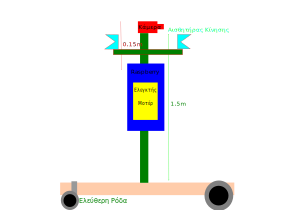
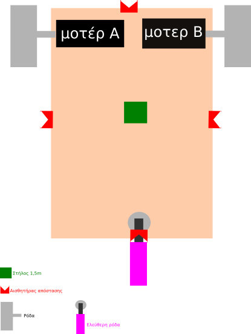

# sxolikosfylakas - Σχολικός Φύλακας
An autonomous robot that recognises human faces and alerts via email if any unauthorized person enters  the school region.
Ένα αυτόνομο ρομπότ που αναγνωρίζει ανθρώπινα πρόσωπα και σε περίπτωση εισβολής μη αναγνωρίσιμου προσώπου τις ώρες που το σχολείο είναι κλειστό θα ενημερώνει με email.

<h2>Γενικό Πλάνο</h2>

.. θα συμπληρωθεί εδώ το μηχανολογικό & ηλεκτρονικό σχέδιο του ρομπότ.
<h2>Πλάνα από την αρχική - βασική λειτουργία κίνησης</h2>
<a href="https://www.youtube.com/watch?v=PikkqNtC3kI">Πατήστε εδώ για το video</a>

<h2>Υλικά</h2>
Πρόκειται να χρησιμοποιήσουμε  τα παρακάτω υλικά:

<table>
  <col align="center">
  <col align="center">
  <col align="center">
  <tr>
    <th>α/α</td>
    <th>Όνομα</td>
    <th>τεμάχια</td>
  </tr>
  <tr>
    <td>1</td>
    <td><a href="https://grobotronics.com/pir-sensor-module.html">Αισθητήρας Ανίχνευσης Κίνησης HC-SR501</a></td>  	
    <td>2</td>
 </tr>
 <tr>
  <td>2</td>
	<td><a href="https://grobotronics.com/waveshare-sound-sensor.html">Waveshare Αισθητήρας Ήχου</a></td>
  <td>1</td>
 </tr>
 <tr>
  <td>3</td>
  <td><a href="https://grobotronics.com/waveshare-infrared-reflective-sensor.html">Waveshare Υπέρυθρος Αισθητήρας Εμποδίων</a></td>
  <td>1</td>
</tr>
 <tr>
  <td>4</td>
  <td><a href="https://grobotronics.com/infrared-proximity-sensor-sharp-gp2y0a21yk.html">Αισθητήρας Απόστασης Υπέρυθρος - Sharp GP2Y0A21YK</a></td>
  <td>4</td>
 </tr>
 <tr>
  <td>5</td>
  <td><a href="https://grobotronics.com/power-supply-5v-2.5a-raspberry-pi-official-black.html">Τροφοδοτικό 5V 2.5A για Raspberry Pi Μαύρο (Γνήσιο)</a></td>
  <td>1</td>
</tr>
<tr>
  <td>6</td>
  <td><a href="https://grobotronics.com/micro-sd-16gb-pre-loaded-with-noobs.html">Micro SD 16GB - Pre-Loaded with NOOBS</a></td>
  <td>1</td>
</tr>
<tr>
  <td>7</td>
  <td><a href="https://grobotronics.com/raspberry-pi-heatsink-silver-set-of-3.html">Raspberry Pi Heatsink - Black (Set of 2)</a></td>
  <td>1</td>
</tr>
<tr>
  <td>8</td>
  <td><a href="https://grobotronics.com/raspberry-pi-camera-module-noir-v2-8mp-1080p.html">Raspberry Pi Camera Module  (8MP,1080p)</a></td>
  <td>1</td>
</tr>
<tr>
  <td>9</td>
  <td><a href="https://grobotronics.com/raspberry-pi-3-case-red-and-white-compatible.html">Raspberry Pi 3 Case Red & White - Compatible</a></td>
  <td>1</td>
</tr>
<tr>
  <td>10</td>
  <td><a href="https://grobotronics.com/waveshare-rpi-motor-driver-hat.html">Waveshare RPi Motor Driver HAT</a></td>
  <td>1</td>
</tr>
<tr>
  <td>11</td>
  <td><a href="https://grobotronics.com/raspberry-pi-3-model-b-el.html">Raspberry Pi 3 - Model B+</a></td>
  <td>1</td>
</tr>
<tr>
  <td>12</td>
  <td><a href="https://grobotronics.com/servo-mini-3.5kg.cm-feetech-ft1117m.html">Κινητήρες Servo</a></td>
  <td>1</td>
</tr>
<tr>
  <td>13</td>
  <td>ΚΕΡΑΙΑ WIFI για το raspberry</td>
  <td>1</td>
</tr>
</table>

<h2>Καταμερισμός Εργασιών</h2>

<table>
<tr>
<th>α/α</th>
<th>Υποέργο</th>
<th>Υπεύθυνοι</th>
</tr>
<tr>
	<td>1</td>
	<td>Ηλεκτρονικά</td>
	<td>Παναγιώτης (ΓΠ) Γιώργος (ΒΠ) </td>
</tr>
<tr>
	<td>2</td>
	<td>Κίνηση Ρομπότ - Κώδικας</td>
	<td>Θεοδωρής (ΓΠ) Βαλάντης (ΓΠ) </td>
</tr>
<tr>
	<td>3</td>
	<td>Αναγνώριση Προσώπου</td>
	<td>Μίλτος (ΔΠ) Μαρία Τ.(ΒΠ) Ελβίρα(ΔΠ) Μιχάλης (ΔΠ)</td>
</tr>

<tr>
	<td>4</td>
	<td>Ήχος</td>
	<td>Νίκος (ΓΠ)  Ταξιάρχης(ΓΠ)
</tr>
<tr>
	<td>5</td>
	<td>Αποστολή email</td>
	<td>Μαρία Β. (ΔΠ) Μαρία M.(ΒΠ) Ματινα Μ.(ΒΠ)</td>
</tr>
<tr>
	<td>6</td>
	<td>Βίντεο</td>
	<td>Αργύρης (ΒΠ) Στέφανος(ΒΠ)  </td>
</tr>
<tr>
	<td>7</td>
	<td>Μηχανικό Μέρος</td>
	<td>Μιχάλης (ΓΠ) Παναγιώτης (ΓΠ) Γιώργος (ΒΠ) </td>
</tr>
<tr>
	<td>8</td>
	<td>Επίβλεψη</td>
	<td>Μίλτος (ΔΠ)</td>
</tr>	
	
</table>
<h2>Σχέδιο Τομή</h2>

<h2>Κάτοψη</h2>

